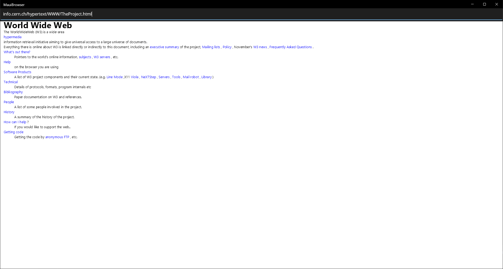

# Maui Browser

MauiBrowser is a basic web browser built using .NET MAUI and C#.
It includes a custom html parser, layout engine, and renderer, which are inspired by the structure described in [browser.engineering](browser.engineering).
SkiaSharp is used for canvas rendering.
The layout is not fully correct, but I'm happy with what I achieved :)

# Build requirements

- Install .NET SDK 8.
- Install .NET MAUI either via the Visual Studio installer or by running `dotnet workload install maui` in the terminal. 
- Open the solution (.sln) either via Visual Studio or Rider (VS Code might also work with an extension).

