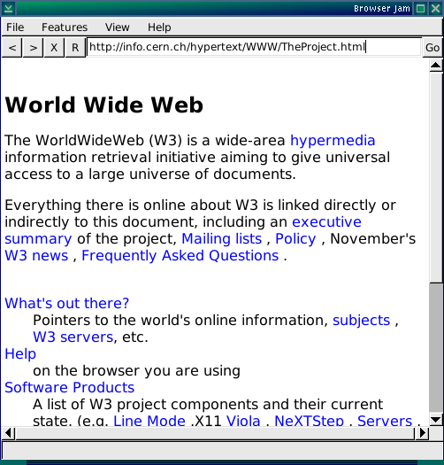

# Build Instructions

## Install a D compiler

Get a D compiler. Just about any D compiler should work, but the OpenD CI build here is what I'll point you to and assume you do this for the rest of the instructions:

https://github.com/opendlang/opend/releases/tag/CI

Direct link as of writing this (but CI links can change so no promises long term)

Windows: https://github.com/opendlang/opend/releases/download/CI/ldc2-4582e71d-windows-multilib.7z

Linux: https://github.com/opendlang/opend/releases/download/CI/ldc2-4582e71d-linux-x86_64.tar.xz

In theory, Mac will work if you have XQuartz installed too, but I didn't finish the font class on Cocoa yet so you'll definitely need to build it for X11. I didn't even test this much though, so I assume Mac is not actually going to work.

The links there are to zipped archives rather than installers. Just unzip them wherever and you can delete the directory when you want without worrying about it spamming your hard drive in random places.

```
# on linux
$ cd ~
$ mkdir opend
$ cd opend
$ wget https://github.com/opendlang/opend/releases/download/CI/ldc2-4582e71d-linux-x86_64.tar.xz # download the file
$ tar Jxf ldc2-4582e71d-linux-x86_64.tar.xz
```

On Windows, use 7zip to extract it, it doesn't matter if it is still in Downloads, in fact, that's what I'll assume going forward. Right click -> Extract here, or `7zr.exe x ldc2-4582e71d-windows-multilib.7z` (7 zip download available here: https://www.7-zip.org/download.html the "7zr.exe (x86) : 7-Zip console executable" can be used direct from Downloads without installing it).

## Build the browser

Having download this repo, open up your command shell and cd into the same directory as this readme file.

Run the D compiler using the `-i` switch on the `jambrowser.d` to build. All required dependencies are included in this directory and the `-i` switch will auto-include them, so it really is that simple! You don't even need to put the compiler in your path, just run it direct from the extract location.

The compiler name in the suggested download is `ldc2`.

Linux:
```
$ ~/opend/ldc2-4582e71d-linux-x86_64/bin/ldc2 -i jambrowser.d
```

Windows:
```
> %HOMEDRIVE%%HOMEPATH%\Downloads\ldc2-4582e71d-windows-multilib\bin\ldc2.exe -i jambrowser.d
```

The build takes about 5 seconds on my computer (slow, sigh).

## Run the browser

Run the `jambrowser` executable! You must run it from this directory, or it will throw a file not found exception when trying to load `default.css`.

Its home page is a file that exists on my computer, so you'll see a lovely "File not found" by default, but you can either run it with a path: `jambrowser http://info.cern.ch/hypertext/WWW/TheProject.html` or type that right into your address bar and go. Don't forget the `http://` as it doesn't auto add that reliably.

Note that on Windows, the keyboard focus is buggy in the browser window, so keyboard scrolling is going to not work well. I ran out of time before having a chance to fix that. Should work ok on Linux though. Mouse scrolling and clicking links ought to work ok, and the menu is fairly functional.



# Explanations

The `jambrowser.d` file was written this weekend, but most the files in the `arsd` folder were not. I wrote them all almost myself (there are several PRs to them from other contributors over the years, but of the lines written here, I wrote probably 90-95% of them from scratch), but not all this weekend! Some of the code in them dates back more than 15 years (I didn't start using git until 2011, so git blame ends there, but notice the initial commit already had a lot of stuff).

See my main repository for the original files and their commit history:

https://github.com/adamdruppe/arsd

There were several changes this weekend, but the bulk of this code was already written.

The `jambrowser.d` file has the UI and the block layout code. That's new this weekend.

The HTML and CSS parsers are found in `arsd/dom.d`. I wrote most of this in 2010.

The text layout is in `arsd/textlayouter.d`, using font information provided by code in `arsd/simpledisplay.d`.  This is fairly new, from 2022.

The HTTP implementation is in `arsd/http2.d` (it is a http 1.1 impl, but second major version of my library...). This was originally written in 2013.

The window drawing library is in `arsd/simpledisplay.d`, and `arsd/minigui.d` builds widgets on top of that for the menus, buttons, etc. This dates back to 2011.

You might notice arsd upstream also has image libs and even a `script.d`... maybe someday I'll come back and integrate these too. (Of course, there's also an `arsd/webview.d` in there, that wraps up Chromium engines, but where's the fun in that? Maybe I'll provide an alternative backend for that using the browserjam thing lol)

***

As you might guess, this isn't the first time I've played with the idea of doing a from-scratch browser. In fact, I tried one back around 2014, figuring I already had this dom library (which I didn't write as part of a browser - its primary job is web templating, and its secondary job is web scraping, but once you have those working conveniently, it feels like a browser is just around the corner) so it isn't that hard right?

Well... it actually did kinda work! Here's some screenshots from that previous attempt:


I had images and forms kinda working - in many ways, that old browser was more functional than this new one! But it also had some problems. Notice the bizarre word wrap in that third screenshot? After the "RPG creation toolkit" link? Yeah... it assumed all nodes were single rectangles. It also uses a monospace font both because my text layout libraries were poor. And they remained poor for a long time - it took me three tries to make a text layouter lib that I didn't think was useless junk.

But now I have one, so getting back into a browser is something I wanted to do for a while anyway! But I'm out of time, so even this story has to wait, time to go.
