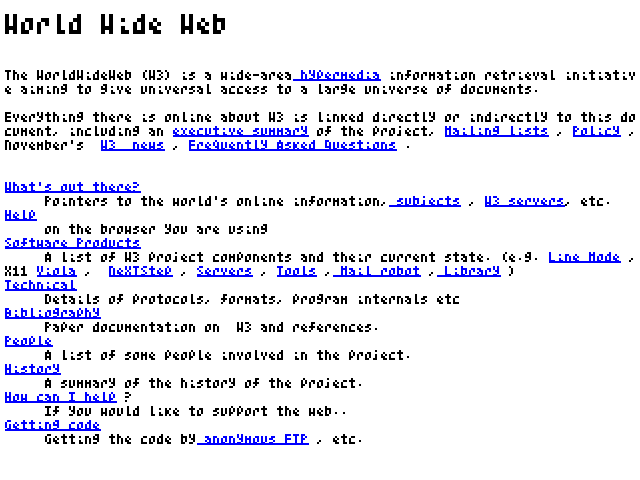

# Browser in C89 without libc

The actual rendering "engine" does not use any libc functions. For
getting the HTML in the memory and writing the image to a file, some I/O
functions are used.

# Preview

