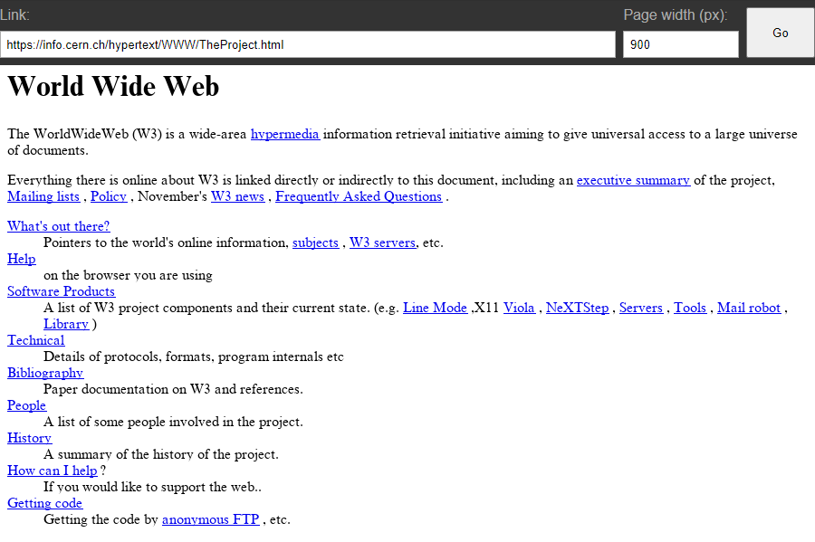

# ek's PHP browser

This is a basic browser engine written in PHP.

See it LIVE: https://php-browser.ekga.me/

## Why?

I thought a browser in PHP would be funny and so far - it proved to be pretty funny.

## How does it work

1. The application runs as a PHP server.
2. It takes a link as a query argument and downloads it's HTML contents.
3. Then it processes the HTML to produce an image of the page.
4. The image is then displayed in a traditional browser.
5. Additionally, an image-map is generated for the image, making the links actually clickable, so you can browse the website.

The "browser chrome" is normal HTML/CSS with a form to input a different URL for rendering and a target page width. To go back to the previous page - just press the back button of the actual browser.

If any errors occur (can't download page, invalid link, rendering error, etc.) - the error message is formatted to HTML and also displayed as an image.

## Philosophy

### HTML parser
I've written many a parser in my time, so I wasn't interested in writing one from scratch. I decided to use the `paquettg/php-html-parser` library for that. It wasn't without it's pitfalls though - it doesn't handle auto-closing unclosed tags, so I had to write some workaround for that. There was an issue where `<NEXTID 1>` tag would trip it up later, because it's interpreting `1` as an attribute name, but parsing it as a number.

### Layout engine
It does not follow any spec and I didn't use any tutorials writing it. I call it "Vibe Driven Development" - I relied solely on my intuition on how it should work and did my best to implement it from there. I tried to make it fairly clean, but ended up with a bunch of hacks anyway. I'm still pretty happy with how it turned out.

### Rendering
I used `intervention/image` library for rendering the image. It's pretty basic and just enough for what I needed. It can draw basic shapes, measure and draw text with specified font, but no underlines - those were had to be hacked im by just drawing a line under text. I think it turned out fine.

## How to run it

I'm hosting the server myself here: https://php-browser.ekga.me/

If you want to run it on your local machine:

1. Install Docker and Docker Compose
2. Clone the repository and open this folder in the terminal
3. Run `docker compose up --build`
4. Open `http://localhost:8080/` in your browser

If you want to host it on your own server, the Docker image is published as `ekgg/php-browser`.
