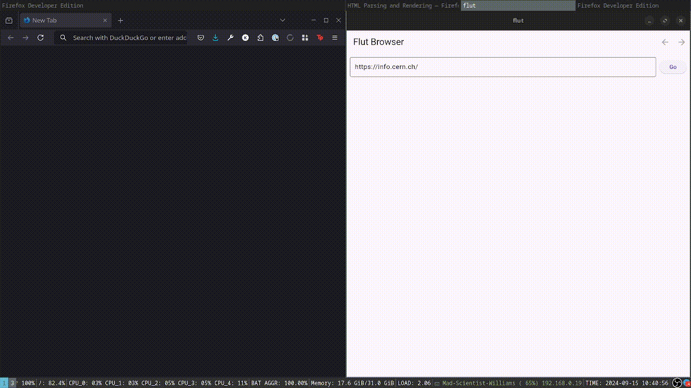

# Flut browser

You can run it in your browser using the version hosted on [dartpad](https://dartpad.dev/?id=711d2ef828ac9942df87a3a713b9f359) (navigating won't work due to dartpad security rules)

## Setup and run 
- install flutter
- run flutter pub get
- flutter run  

### see it in action

