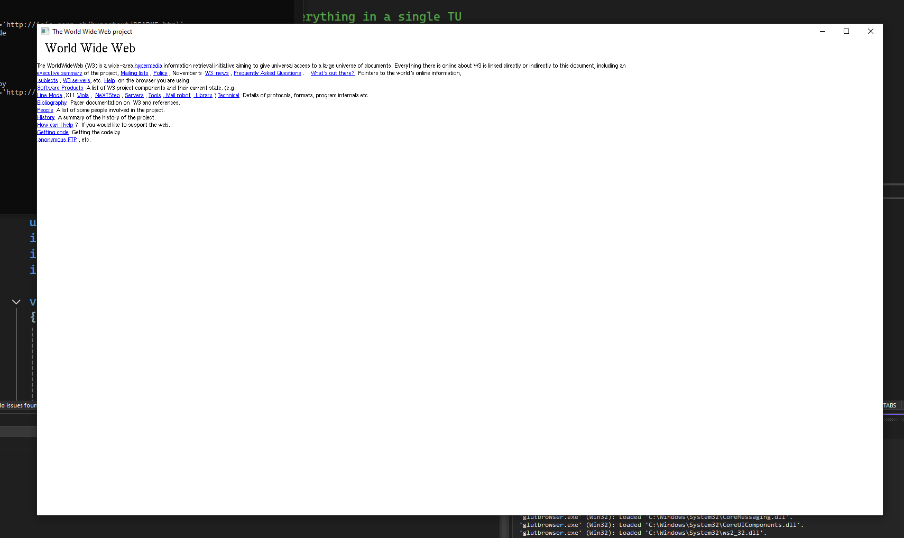

# GLUTBrowser - Made with only OpenGL and GLUT using C

This was a browser made in a weekend (really, 1 and a half days) for Browser Jam. The html parser was made entirely from scratch and is not very compliant (to say the least.) Line breaks are handled poorly, but you can render some basic web pages. Mouse input is working, but you unfortunately can't navigate because I don't have web requests working yet.

## Building (Windows)

You must have VS2022, git (of course), and CMake. You can also probably build with GCC in MinGW, or Clang... if you have that installed then you can just change generators in the presets.

With the repo checked out, from this directory, run
```
git submodule update;
cd freeglut; cmake .; cmake --build .; cd ..;
cmake --preset=win-msvc-debug .;
```

## Loading a page

You must call the browser with the html filename as the first argument, e.g.
```
.\glutbrowser.exe "C:\\Users\\<user>\\Downloads\\The World Wide Web project.htm"
```
If all goes well, you will see a bare-bones webpage with a bit of styling.


