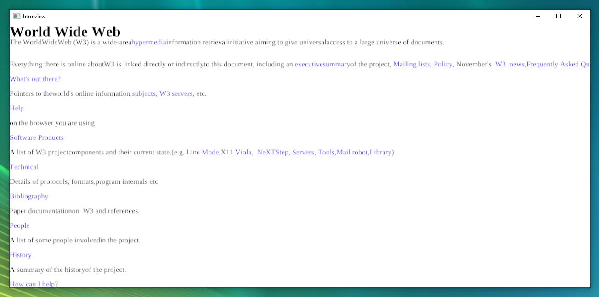
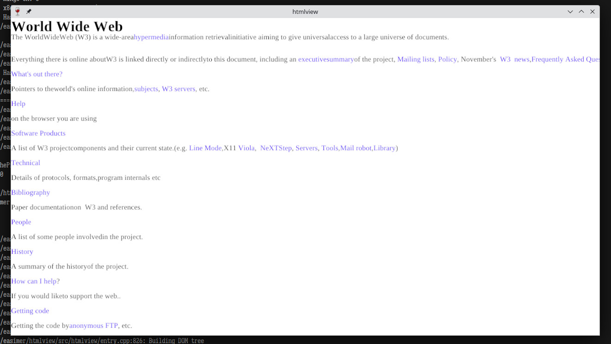

# htmlview

An entry for the [2024 Browser Jam](https://github.com/BrowserJam/browserjam/blob/b01e389642dc0f2e3da2f6dd7765cca74704792d/README.md).

The canonical source code can be found at https://git.easimer.net/easimer/htmlview
The version that was submitted to the jam is tagged `jam-submission`.

- /src/embed/ - A tool used to embed files into the executable
- /src/gpu/ - The D3D11 renderer
- /src/htmlview/ - The browser itself
  - /src/htmlview/HTTP.cpp - The HTTP client; built on WinSocks2
  - /src/htmlview/HTML.cpp - The HTML tokenizer
  - /src/htmlview/DOM.cpp - The DOM tree builder
  - /src/htmlview/entry.cpp - The application logic and layout stuff
- /src/log/ - Logging library (rxi's log)
- /src/stb/ - stb libraries: stb_rect_pack and stb_truetype for text drawing
- /src/std/ - Data structures

The renderer and the generic stuff was pulled from another project I'm working on, though the renderer got stripped down to features this program actually needs.

The default (and only) font is Liberation Serif, which is included in the repo and baked into the executable.

Stuff implemented:

- Rendering this page: https://info.cern.ch/hypertext/WWW/TheProject.html and some other pages linked on that site
- Multi-size fonts (one size for regular text, 6 other sizes for the headings)
- Colored text (regular text is black, links are blue)
- Scrolling (with the mouse wheel)
  - Can't scroll past the beginning or the end
- Navigation (by clicking on links)
  - A bit buggy and might not work with every link, because `<a>` elements have incorrect widths
- Navigating back (by pressing Alt-Left)

Features not implemented:

- Correct spacing between words
- Margins in block elements
- Line wrapping

A demo video can be found at [docs/demo.mp4](docs/demo.mp4).

## Building

Since this uses Windows APIs for rendering and sockets, this can only be built for Windows/Wine.
The CMake presets are configured to use clang because that's what I used during development, but MSVC might also work.

### Windows

```sh
cd htmlview

# A debug build with compile_commands
cmake --preset dev
cd out
ninja htmlview
cmake --build . --target htmlview
.\_bin\Dbg\htmlview.exe

# A release build
cmake --preset release
cd out-rel
ninja htmlview
cmake --build . --target htmlview
.\_bin\Rel\htmlview.exe
```



### Linux (Wine)

I got this to build and run with the x86_64-x64-mingw32 toolchain and `mingw-w64-wine`.
On Arch Linux you'll need `mingw-w64-toolchain` and `mingw-w64-wine` packages (the latter is on the AUR).
I also used the `mingw-w64-cmake` package from the AUR for configuring the build:

```sh
cd htmlview
x86_64-w64-mingw32-cmake -S . -B out
cd out
cmake --build . --target htmlview

x86_64-w64-mingw32-wine _bin/htmlview.exe
```


