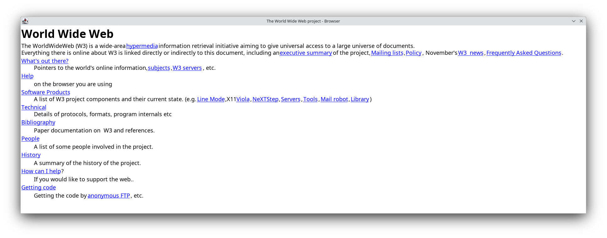

# Browser Jam 001

> https://github.com/BrowserJam/browserjam
>
> Build a browser from scratch that can render the first-ever website: http://info.cern.ch/hypertext/WWW/TheProject.html.

## Build instructions

* Install [Haxe 4.3.6](https://haxe.org/download/)
* Install the java library `haxelib install hxjava`
* Build `haxe build.hxml`

## Run instructions

* Download the HTML page locally
* Run `java -jar build/browser.jar page.html`

## Preview

The rendering doesn't support line wrapping and the window is hardcoded at 1800x800.

## License

The code is licensed under the [MIT license](./LICENSE.md).
