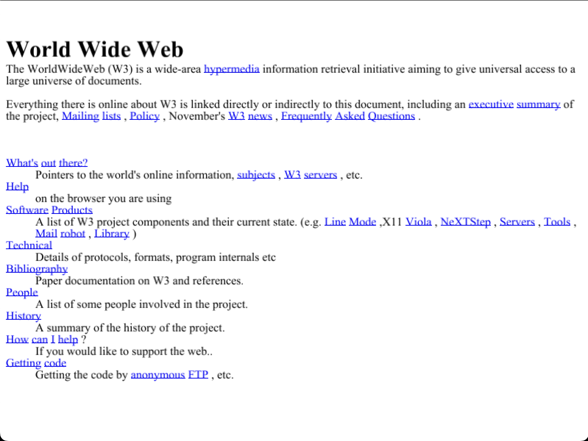

# Kale

Kale is a toy browser written for the first ever Browser Jam. Here's a screenshot of it in action: 



There are lots of missing features, but it's a start!

## Running Kale

To run Kale, you'll need to have Rust installed. You can install it by following the instructions [here](https://www.rust-lang.org/tools/install).

After you have Rust installed, you can run Kale with the following command:

```bash
cargo run
```

This will build and run Kale. The default page is set to `pages/project2.html`, but you can change this by passing a different url as an argument to the `cargo run` command.

```bash
cargo run -- "https://www.google.com"
```

This will open Google in Kale.

## Features

Kale is a very basic browser, and as such, it's missing a lot of features. It can render some simple HTML, but it doesn't support CSS or JavaScript. It supports clicking to links and scrolling, but nothing else.

