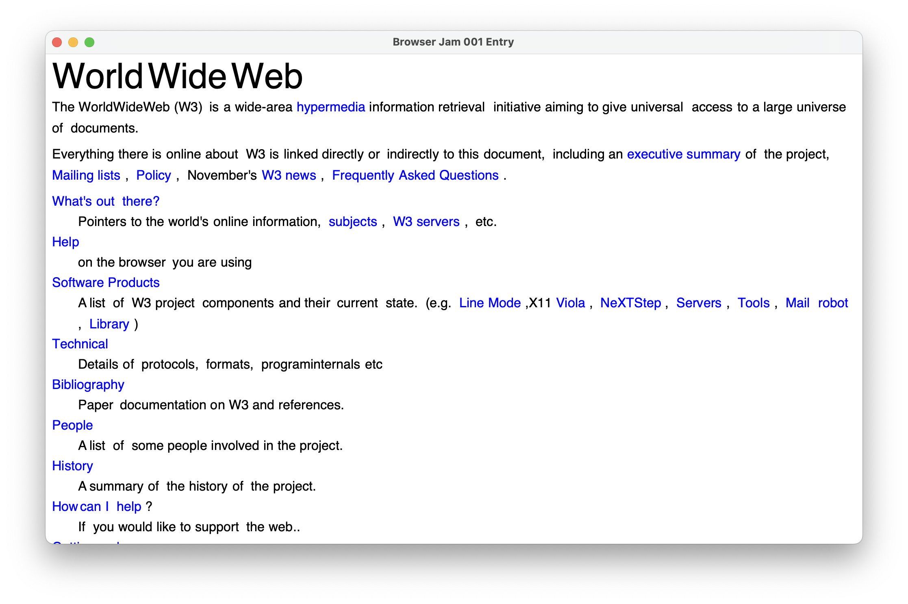

# JellyNet

JellyNet is my attempt at writing a browser for this jam (get it?). Here's the best result I was able to get within time:

## Building / Running

Simply run `cargo build` or `cargo run` in the root directory of the project. I love rust.
