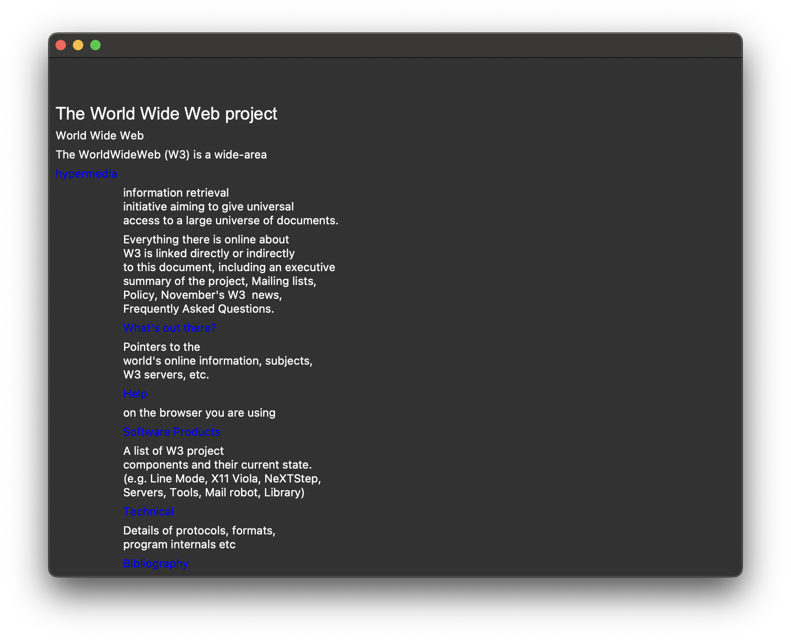
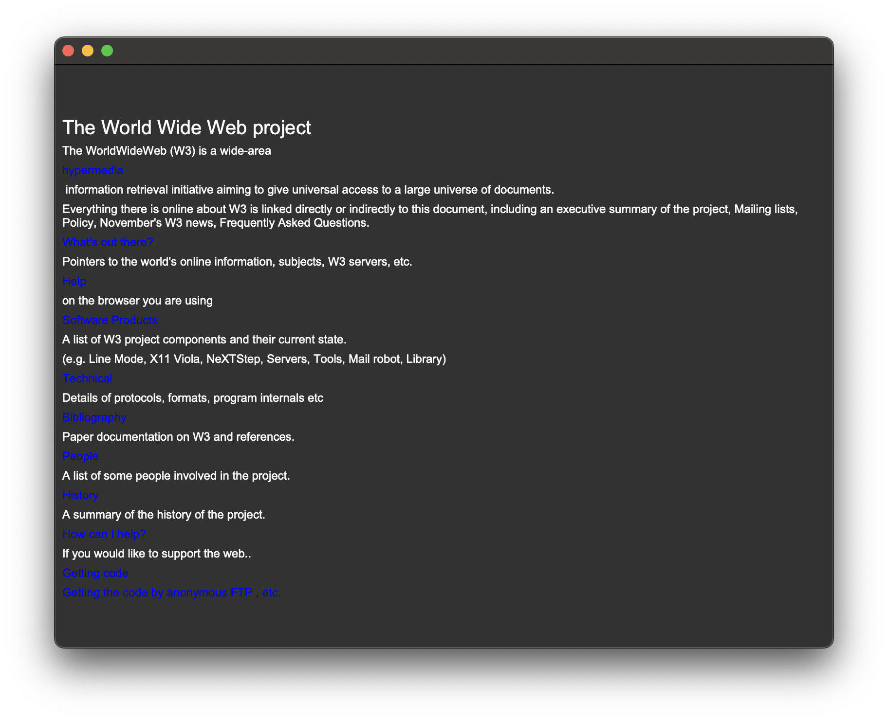
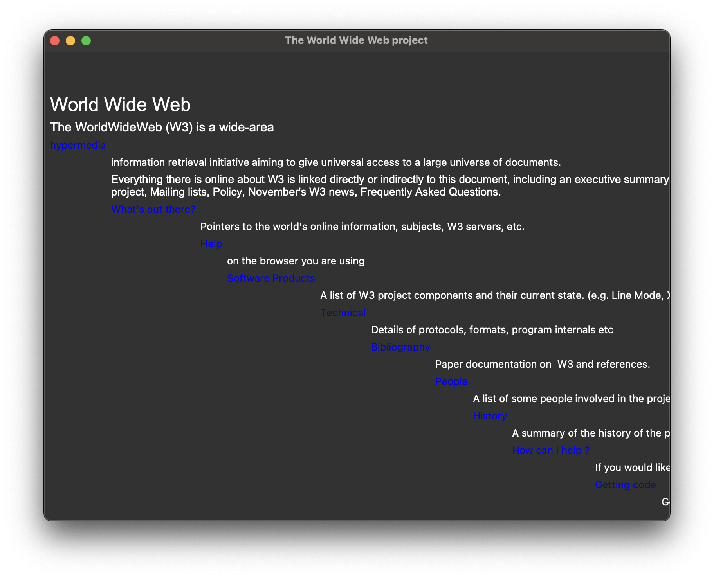

# LLMs Make For Really Bad Browsers

People keep going on about how great AI is, and how they're gonna make the next AI Browser...but they cannot seem to comprehend that the only true AI Browser is this one.

## What?

This uses only an LLM model to understand HTML, and produce a command list for rendering it.
Yes.

## How?

Very simple Pipenv setup, just get an OpenAI API key and you're good to go:
```console
$ export OPENAI_API_KEY="your-key-here"
$ pipenv lock && pipenv sync
$ pipenv run python main.py
```

The program is only tested on the one URL in the code, so treat it with care :^)

## What's it look like?

Outputs can range from literally nothing to any of the following:



