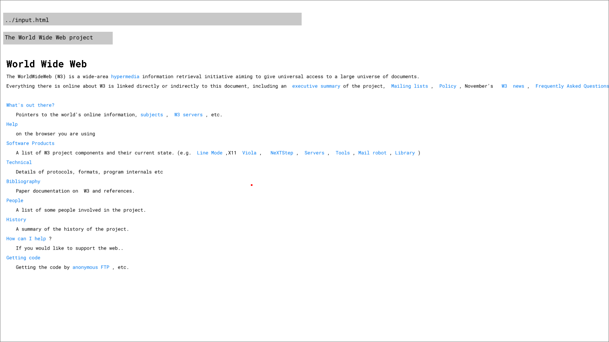

# Browser

This is my submission for Browser Jam 2024(https://github.com/JorisUn/BrowserJam2024)

This project has been made entirely in C using meson build system and raylib graphics library.

## Build

Tested on linux.

Ensure to have installed:
1. Cmake
2. Meson

After cloning the repo:
1. Run `meson build` in the main directory
2. Go to the created 'build' directory and run `meson compile`
3. Run ./browser executable

## Usage

This browser can render only local files.  
The file path must be entered into the search bar relative to the project/build directory, where the executable sits.  
If Enter is pressed, the program will attempt to render the html content.  
If the entered file doesn't exist, the bar will turn red.  

---

To exit the program pres ESC.  
You can use scrollwheel to navigate the page.  
Pressing f will attempt to enter fullscreen.  

## Features

The browser discards all tags (but not their content) and renders only text content.  
Although hyperlink tags appear blue, they lack functionality.  
The page title is rendered in a gray window below the seach bar.  
All of the header types (h1-h6) appear the same due to time constraints on my part.  
