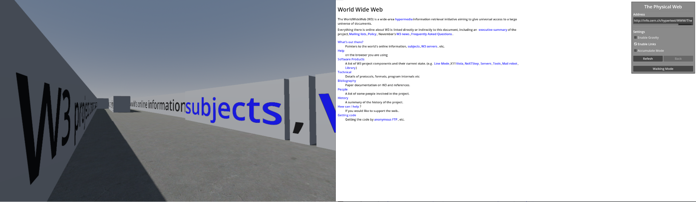

# The Physical Web

Bring the classic web browsing experience into the physical realm, in two ways:
 - **2D mode**: This is the default mode. You are given an address bar, as well as some toggle settings. You can drag any element around, and it will collide with others, as a 2D physics object. You can toggle the settings for some fun effects. Also try right clicking on the page :-)

 - **Walking Mode**: You can activate this my clicking the `Walking Mode` button in the settings box. You are placed inside the web page, and can walk around freely (WASD + Mouse Look). Touch any link element to be transported there.

## Building
You need Godot version v4.3.stable (https://godotengine.org/download/archive/4.3-stable/). Simply open the project and press `Run Project`!

## Screenshot

