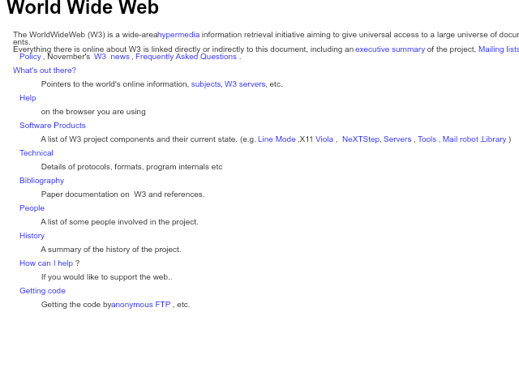

# Leveret

> Browser Jam instructions:
> Install Bun and run using:
> ```
> cd tomashubelbauer
> bun install
> bun .
> ```
>
> The rendered frame is in `index.png`.
> Also check out the other `.png` files produced by render tests.

An experimental web browser based around the Bun JavaScript/TypeScript runtime.
The browser engine is built around the `@napi-rs/canvas` package which uses the
Skia graphics system.



## Tasks

### Figure out if `canvas.data` aliases `CanvasRenderingContext2D.getImageData`

I created a ticket seeking clarification on GitHub:
https://github.com/Brooooooklyn/canvas/issues/894

### Use Bun's C compilation feature to display a native window to flush RGBA on

Use Cocoa to display a native macOS window, make an `NSImageView` and export a
method that takes `unsigned char *rgbaBuffer` and builds a `NSBitmapImageRep`
from it, then `NSImage` from the bitmap and sets the image to the image view.

Next up, react to the window size changes by either polling on every frame on
the Bun side or figuring out how to export a method that takes Bun callbacks and
calls them in response to the macOS side event loop resize event entries.

This will allow me to dynamically resize the `canvas` and its context to react
to the window resizing events and re-layout.

Next up, listen to keyboard and mouse events to be able to add interactivity to
the renderer and bring the whole project closer to a full browser.

### Monitor Bun's API surface for a built-in `DOMParser` implementation support

https://github.com/oven-sh/bun/discussions/1522

This would allow me to drop the bespoke HTML to DOM parsing logic.

## Notes

### Architecture breakdown

1. Download the HTML text and parse it to a DOM
2. Measure all elements unrestricted bounding boxes
3. Lay out into a tree of blocks with inline or other block items
4. Render the laid out tree based on the calculated layout coordinates

The current architecture doesn't handle user interactivity (scrolling, clicking,
selecting etc.) nor does it render into a native OS window, the output is saved
to a file at the moment.

### `@napi-rs/canvas` support in Bun

Bun supports `@napi-rs/canvas` since version 1.0.23:
https://bun.sh/blog/bun-v1.0.23#embed-node-files-with-bun-build-compile

### `@napi-rs/canvas` API

- `toBuffer` - synchronous
- `encode` - asynchronous
- `data` - maybe an alias of `CanvasRenderingContext2D.getImageData`?

### Recommended development workflow

Use VS Code and use two editors side by side.
Open `index.ts` in the left one and `image.png` in the right one.
Run `bun --watch .` to monitor `index.ts` for changes.
Make your changes in `index.ts` and save them.
Observe `index.png` in the right editor reflecting the changes.

Use https://bun.sh/guides/runtime/vscode-debugger for debugging code and tests
without having to worry about VS Code debugger setup.

### Graphical system choice reasons

Bun supports including as well as bundling Node native modules since 1.0.23.
Other NPM packages with canvas support (like `canvas`) require Gyp and are pain
to integrate and use while retaining a neat workflow and simple toolchain.

### Dependency management choices

I am using the latest versions of `@napi-rs/canvas` as well as `@types/bun` and
am encoding the versions as `latest` in `package.json`.

I am opting to write my own HTML to DOM parsing fow now as I don't want to be
using a dependency for it.

I will reconsider this choice if Bun ever ships a built-in `DOMParser` support.
See [`DOMParser` on MDN](https://developer.mozilla.org/en-US/docs/Web/API/DOMParser)

### Programming language, toolchain and runtime choices

I chose to use TypeScript because I like it, JavaScript would be my close second
choice.
I used Bun because it lets me set up no toolchain or configuration and just get
to coding.
Especially its ability to include native modules and even compile and run native
code makes it very future-proof for this project's needs (the eventual goal of 
displaying a native OS window and flushing the canvas raw pixel buffer onto its
surface as well as responding to the OS events to implement interactivity with
the browser for the user).

See [Bun Twitter post about native code compilation](https://x.com/jarredsumner/status/1834880518757781919).

## Logs

### 2024-09-14

#### Implemented a `fetch` of the Browser Jam #1 first WWW page assignment


#### Started the repository and put together the basic `@napi-rs/canvas` PoC

This project was inspired by the first ever BrowserJam announced by Andreas
Kling, the founder of the Ladybird browser:

- [Twitter announcement post](https://x.com/awesomekling/status/1834625388510585276)
- [BrowserJam repository](https://github.com/BrowserJam/browserjam)

The project repository is at [`tomashubelbauer/leveret` on GitHub](https://github.com/TomasHubelbauer/leveret).

I installed the Canvas package using `bun add @napi-rs/canvas`.
It installs the main package `@napi-rs/canvas` and a platform-specific package,
in my case `@napi-rs/canvas-darwin-arm64`.

The package has no other dependencies and ships as Node native module (`.node`),
not as plain TypeScript/JavaScript.

See [`Brooooooklyn/canvas` on GitHub](https://github.com/Brooooooklyn/canvas)
for the repository and [`@napi-rs/canvas` on NPM](https://www.npmjs.com/package/@napi-rs/canvas)
for the Node package.

We can see the native module working with this simple script:

(Dependencies installed are `@napi-rs/canvas` and `@types/bun` (development).)

`index.tx`:

```typescript
import { createCanvas } from '@napi-rs/canvas';
import { write } from 'bun';

const canvas = createCanvas(640, 480);
const context = canvas.getContext('2d');

context.fillStyle = 'white';
context.fillRect(0, 0, canvas.width, canvas.height);

context.fillStyle = 'black';
context.fillText('Hello, world!!', 10, 50);

const buffer = await canvas.encode('png');
await write('index.png', buffer);
```

Run using `bun .` and open `index.png` to see the resulting image.

We can also run the example into a native binary using `bun build --compile .`.
The resulting `index` executable requires no dependencies (no `node_modules`)
and can be shipped and ran standalone.
